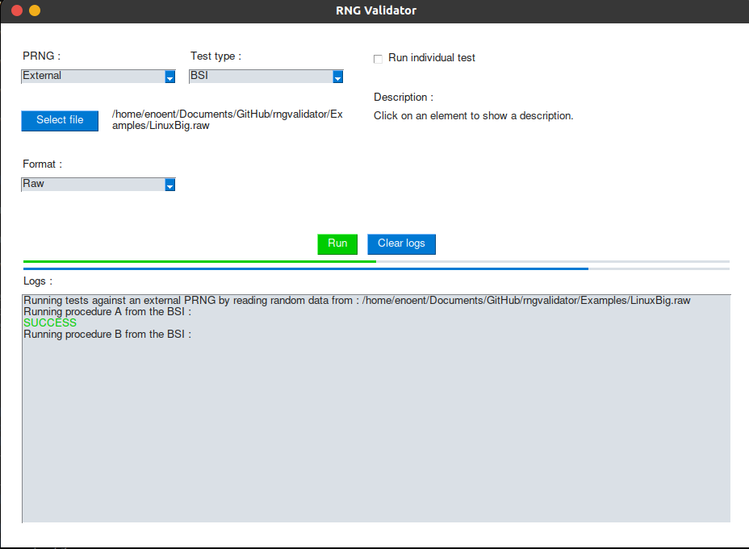

# RNGvalidator

This script aims to verify the quality of random number generators. Statistical tests from the BSI (AIS31) and NIST (SP800-22) are used.

## Dependencies

The following python modules are needed.

```
sudo python3 -m pip install pysimplegui mpmath scipy numpy
```

## Usage

```
./gui.sh
```



## References

BSI :

- [Functionality classes and evaluation methodologyfor true (physical) random number generators](https://www.bsi.bund.de/SharedDocs/Downloads/DE/BSI/Zertifizierung/Interpretationen/AIS_31_Functionality_classes_evaluation_methodology_for_true_RNG_e.pdf?__blob=publicationFile&v=1)
- [Functionality classes for random number generators](https://www.bsi.bund.de/SharedDocs/Downloads/DE/BSI/Zertifizierung/Interpretationen/AIS_31_Functionality_classes_for_random_number_generators_e.pdf?__blob=publicationFile&v=1)

NIST:

- [A Statistical Test Suite for Random and Pseudorandom Number Generators for Cryptographic Applications](https://nvlpubs.nist.gov/nistpubs/legacy/sp/nistspecialpublication800-22r1a.pdf)
- [Guide to the Statistical Tests](https://csrc.nist.gov/projects/random-bit-generation/documentation-and-software/guide-to-the-statistical-tests)

## Contributors

- [Florian Picca](https://github.com/FlorianPicca)